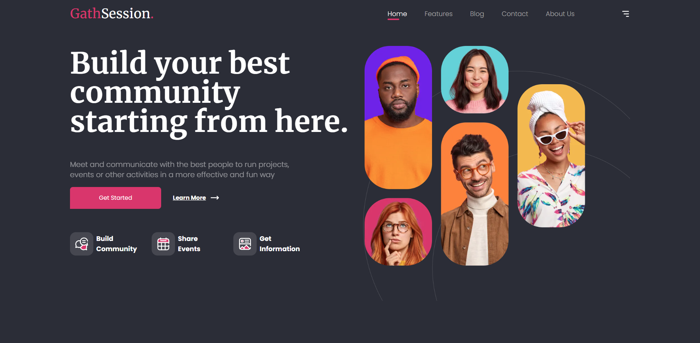
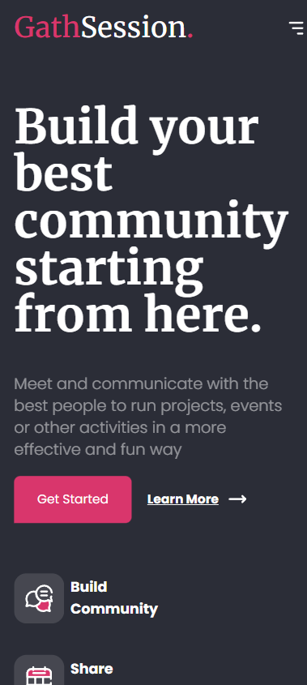
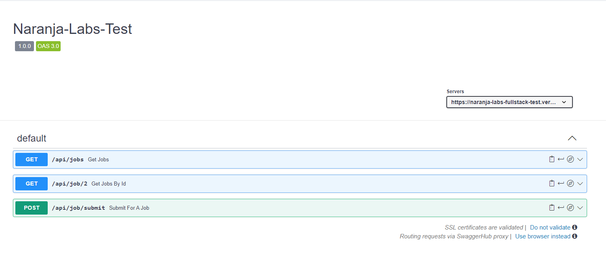
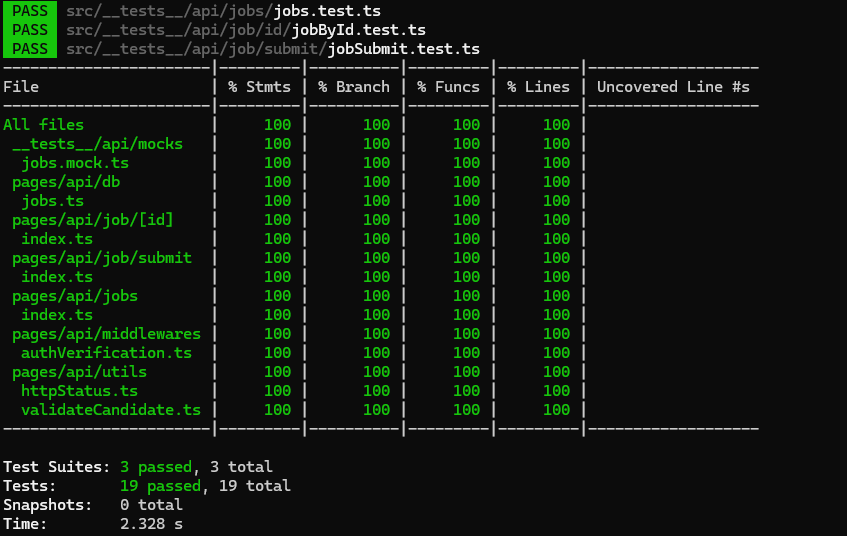
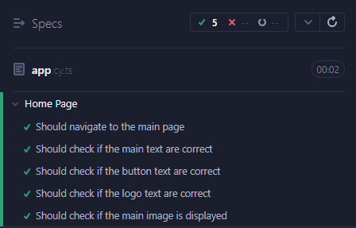
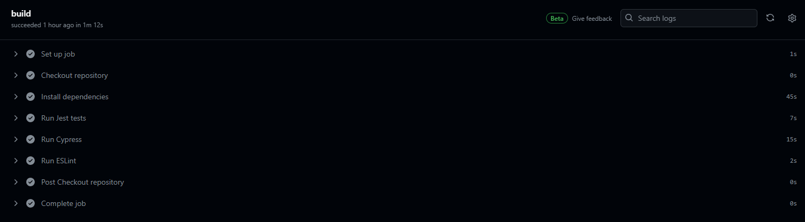

# 🚀 Desafio Técnico - Full Stack Junior

## 📋 Descrição
Projeto realizado para fins de teste e aprendizado, focando na proposta elaborada pelo README do processo seletivo da Naranja Labs.

O projeto contém uma landing page feita com base no Figma proposto pelo processo seletivo, além de também ter endpoints para consulta via API.

## 👌 Exemplos da Aplicação

### Tela Principal:





## 🛠️ Tecnologias Utilizadas

- **Front-End**: Next.js 14.1.4
- **Back-End**: Next.js 14.1.4 (API Routes)
- **Testes**: Jest, Supertest (para testes de unidade da API) e Cypress (para testes E2E)

## ✨ Funcionalidades

- Landing page do Front-End na rota "/"
- Buscar empregos na rota "/api/jobs"
- Buscar nível do emprego utilizando o query params "level" na rota "/api/jobs"
- Buscar emprego por id na rota "/api/job/id"
- Candidatar-se à vaga na rota "/api/job/submit"


## 🔧 Instalação
Para executar localmente o projeto, siga os seguintes passos no seu terminal:

- Faça o clone do projeto na sua máquina

```bash
git clone git@github.com:coqueirojoao/fullstack-junior-1.git
```

- Acesse a pasta que foi clonada

```bash
cd fullstack-junior-1
```

- Instale todos os pacotes necessários para que o app funcione

```bash
npm install
```

- Execute o comando para inicializar a aplicação

```bash
npm run dev
```

- Acesse no seu navegador a url abaixo para visualizar o front-end 

```
http://localhost:3000
```

## 💡 Lidando com as requisições

Para fazer as consultas para os endpoints, você deverá executar a sua aplicação, utilizando:

```bash
npm run dev
```


Após isso, crie um arquivo chamado " .env.local " na pasta raiz do seu projeto contendo as seguintes informações:

```bash
SECRET_KEY="naranja-labs"
```

Para todas as requisições, adicione nos headers da sua requisição a chave:

```
secret: "naranja-labs"
```

Você pode agora fazer as requisições para os seguintes endpoints:

- /api/jobs
- /api/job/{id}
- /api/job/submit


### /api/jobs

Exemplo de retorno:

```json
[
    {
        "id": 1,
        "job": "Full Stack Developer",
        "level": "Junior",
        "status": "open"
    },
    {
        "id": 2,
        "job": "Frontend Developer",
        "level": "Junior",
        "status": "closed"
    },
    {
        "id": 3,
        "job": "Backend Developer",
        "level": "Junior",
        "status": "closed"
    },
    {
        "id": 4,
        "job": "Full Stack Developer",
        "level": "Senior",
        "status": "closed"
    }
]
```

### /api/jobs?level=Senior

Exemplo de retorno:

```json
[
    {
        "id": 4,
        "job": "Full Stack Developer",
        "level": "Senior",
        "status": "closed"
    }
]
```

### /api/job/{id}

Exemplo de retorno:

```json
{
    "id": 2,
    "job": "Frontend Developer",
    "level": "Junior",
    "status": "closed"
}
```

### /api/job/submit

- Requisição do tipo POST

Exemplo de corpo para a requisição:

```json
{
    "name": "João",
    "age": 29,
    "phone": "77923444444",
    "state": "Bahia",
    "city": "Poções"
}
```

Exemplo de retorno:

```json
{
    "message": "Thank you for your application, João"
}
```

## 📚 Swagger

Caso prefira, você também pode utilizar o swagger para fazer as requisições e consultar a documentação da API



```
https://app.swaggerhub.com/apis/JAAUMP95/naranja-labs_test/1.0.0
```


## ⚙️ Executando os testes

Para executar os testes automatizados siga os seguintes passos:

### 🧪 Testes unitários (Back-End)
- Para executar o testes unitários, execute o seguinte comando no seu terminal:

```bash
npm run test
```

- Para obter a cobertura dos testes unitários, execute o seguinte:
```bash
npm run test:coverage
```



### 🔩 Testes E2E (Front-End)

- Para executar os testes de fim a fim, execute o seguinte comando no seu terminal:

```bash
npm run cypress:run
```

- Caso queira ter uma interface visual para os testes, execute:

```bash
npm run cypress:open
```



## 🧱 CI/CD

Também foi feito CI/CD para o projeto, utilizando GitHub Actions para validar os testes e o Vercel para fazer o deploy.



- Endereço para o deploy:

```
https://naranja-labs-fullstack-test.vercel.app/
```


